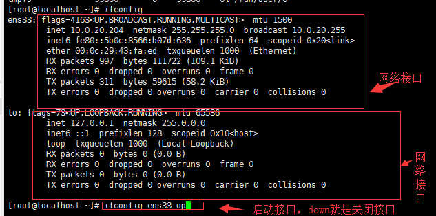
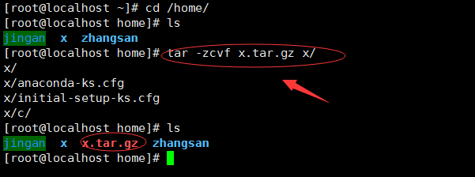
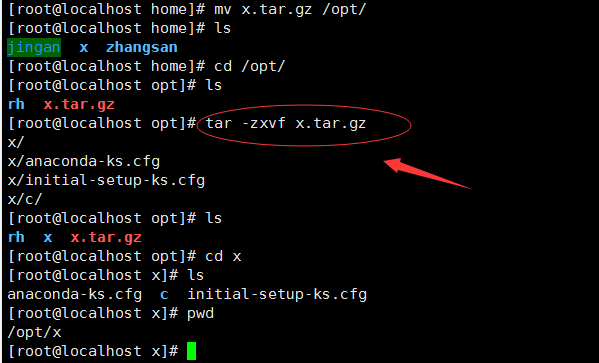

系统管理命令： ps -aux（查看进程ID，启动了哪些进程都可以使用这个命令查看）

    ps命令可以查看进程的详细进程
    
    选项                         含义
     -a                          显示终端上所有进程，包括其他用户的进程
     -u                          显示进程的详细状态
     -x                          显示没有控制终端的进程（一般都是守护进程）
     -w                          显示加宽，以便显示更多的信息
     -r                          只显示正在运行的进程   
    
    非守护进程跟终端有关，如果终端未关闭则可以通过命令查询(例如：查看profile)输入：ps -aux | grep tail
    守护进程是一类在后台运行的特殊进程
     
top命令

    用来动态显示运行中的进程（cpu占比、空闲内存、使用内存等）。top命令能在运行后，在指定的时间间隔更新显示信息。
    可以在使用top命令时加上-d来指定显示信息更新的时间间隔。
    在top命令执行后，可以按下按键得到对显示的结果进行排序：
    
    按键                       含义
     M                         根据内存使用量来排序
     P                         根据CPU占有率来排序
     T                         根据进程运行时间的长短来排序
     U                         可以根据后面输入的用户名来筛选进程
     K                         可以根据后面输入的PID来杀死进程
     q                         退出
     h                         获得帮助
     
终止进程

    kill和killall
    
    例如杀掉进程号为3986的 ---->  kill -9 3986
    例如杀掉所有tail进程   ---->  killall tail
关机重启

    reboot、 shutdown、 init0
    
检查磁盘空间： df

    只显示/dev/sda1表示磁盘分为一个区；若显示/dev/sda1、/dev/sda2 则表示磁盘分为两个区
    查看Mounted on列表：了解是挂载在哪里

    用于检测文件系统的磁盘空间占用和空余情况，可以显示所有文件系统对节点和磁盘块的使用情况
    
    选项                         含义
     -a                          显示所有文件系统的磁盘使用情况
     -m                          以1024字节单位显示
     -t                          显示各指定文件系统的磁盘空间使用情况
     -T                          显示文件系统
     
   如何进行分区
	 根据你的磁盘空间大小进行分区,如果磁盘小于3T,则使用fdisk命令分区,虚拟机只能创建新的虚拟机磁盘
查看或配置网卡信息

检查目录所占磁盘空间：du 

		该命令与df执行结果相似，du更侧重磁盘的使用情况

    ifconfig   （一个网卡下可以有很多的网络接口）
    

    
    重启整台机器网络的命令： service network restart （因为可能你只是使用其中的某个网络接口，而其它人在用其它的网络接口，所以全部重启有时会造成问题）
    重启网络接口：ifconfig ens33 up
		关闭网络接口：ifconfig ens33 down
   
测试远程主机连通性

    ping
    只ping一次的命令：  ping -c1 www.baidu.com
    
查看网络情况

    netstat-ntpl （可以查看监听的ip地址和端口进程号、进程名称）
    
tar 解压或者压缩(z:表示压缩格式（后缀为gz的压缩格式），c：压缩的意思，v:显示压缩的时候的详细情况)

    例如：将"x"目录压缩成名称为"x.tar.gz" 且格式为"gz"的压缩包，命令如下
    [root@localhost home]# tar -zcvf x.tar.gz x/

    

    解压包的命令(x:表示解压) 
    [root@localhost home]# tar -zxvf x.tar.gz
    

    
init6 热重启（还有电源未关闭的状态），安装了新的硬件不会识别，需要冷启动init0
