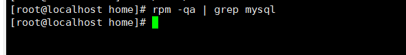
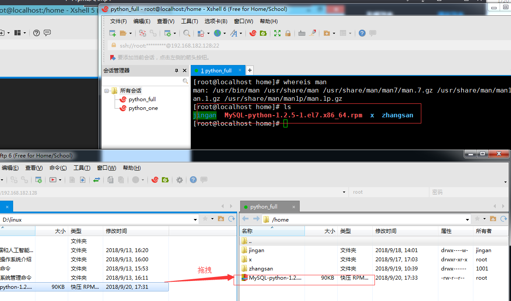
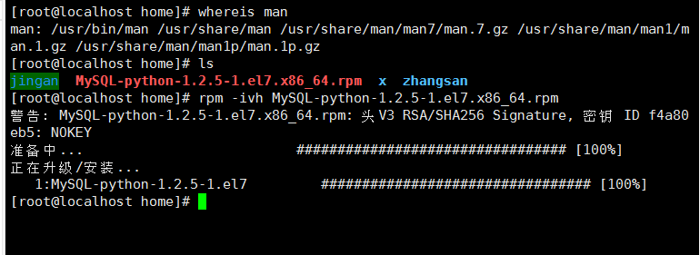
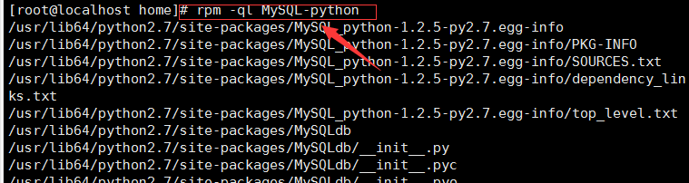

软件安装与管理

    软件包
    1、bin文件.bin(适合所有linux发行版),bin是可以执行文件
        执行一个文件命令： [root@localhost home]# ./install.bin
    2、rpm包，yum(rehat系列)
    3、源码压缩包(适合所有的linux发行版)
    4、官方已经编译好的，下载软件包可以使用(绿色软件)
    
    安装软件的步骤：
    
        1、检查是否已经安装：(-q 表示查询，后面可以接很多参数)
            rpm -qa | grep jdk
            
        2、下载软件包
        3、安装
            依赖
            
    rpm包，已经编译之后的程序
    
    rpm命令：
    
     查询
        rpm -q PACKAGE_NAME: 查询指定的包是否已经安装
        rpm -qa  :查询已经安装的所有包
        rpm -qi  PACKAGE_NAME: 查询指定包的说明信息
        rpm -ql  PACKAGE_NAME: 查询指定包安装后生产的文件列表
        rpm -qc  PACKAGE_NAME: 查询指定包安装后的配置文件
        rpm -qd  PACKAGE_NAME: 查询指定包安装的帮助文件
        rpm -q --scripts  PACKAGE_NAME: 查询指定包中包含的脚本
        rpm -qf /path/to/somefile: 查询指定的文件是由那个rpm包安装生成的
        
     如果某rpm包未安装，我们需查询其说明信息、安装以后会生成的文件；
     rpm -qpi/PATH/TO/PACKAGE_FILE
     rpm-qpl
     

    安装(注意：不能由用户指定安装目录，安装目录是预先定义好的)
        rpm -i/PATH/TO/PACKAGE_FILE
            -h: 以#显示进度;每个#表示%2
            -v: 显示详细过程
            -vv:更详细的过程
            
        rpm -ivh/PATH/TO/PACKAGE_FILE
            --nodeps: 忽略依赖关系
            --replacepkgs: 重新安装，替换原有安装
            --force: 强行安装，可以实现重装或降级
            
    例如:下载安装MySQL-python
    1、先在官网上下载MySQL-python的.rpm文件，然后使用xshell的上传功能，拖拽进入linux中

    不存在依赖关系直接安装
    注意：rpm命令，安装过程不需要你去指定安装路径，rpm文件在制作的时候已经确定了安装路径。
    可以通过命令rpm -ql 进行查询位置

缺点

    某些安装包要安装成功，需要安装大量的依赖文件