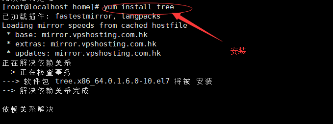
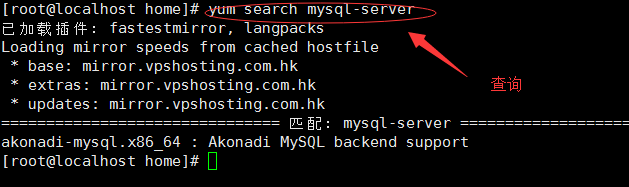
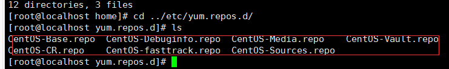
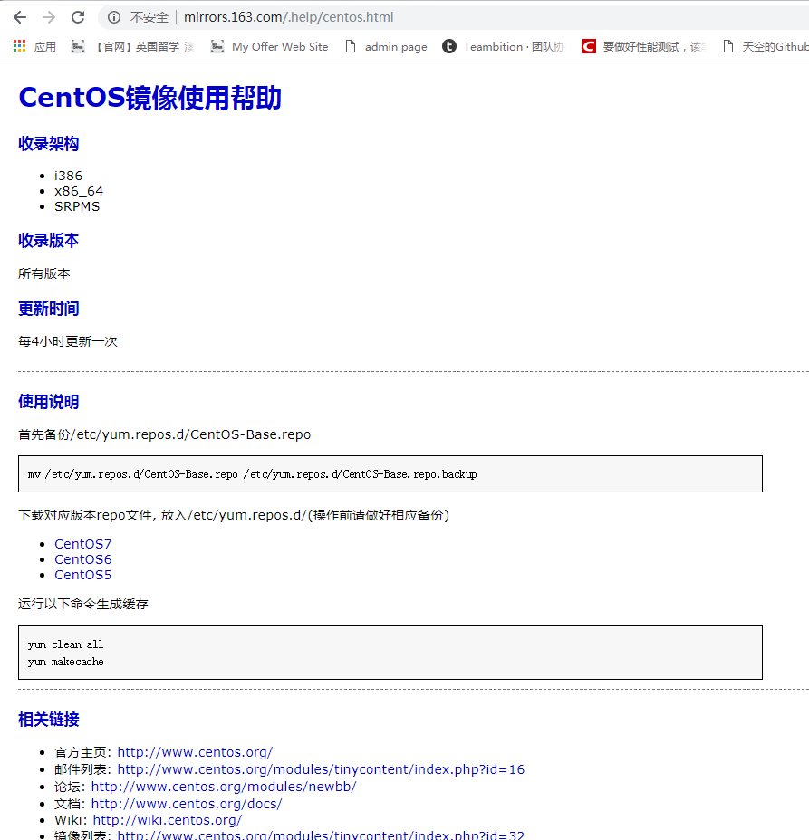
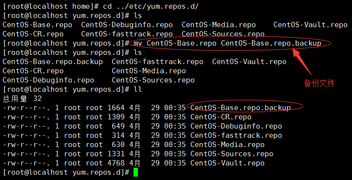
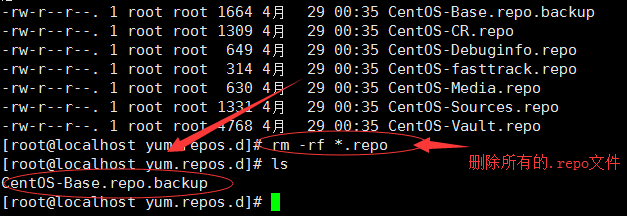
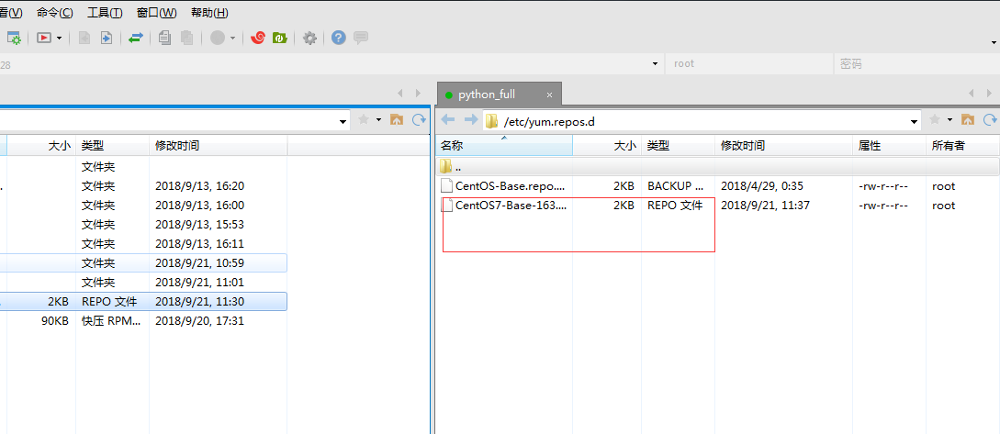
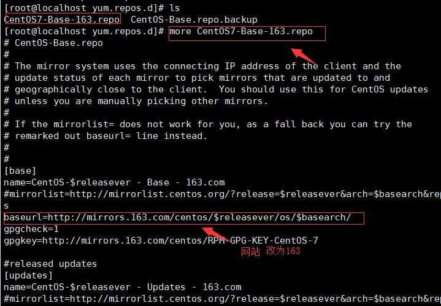
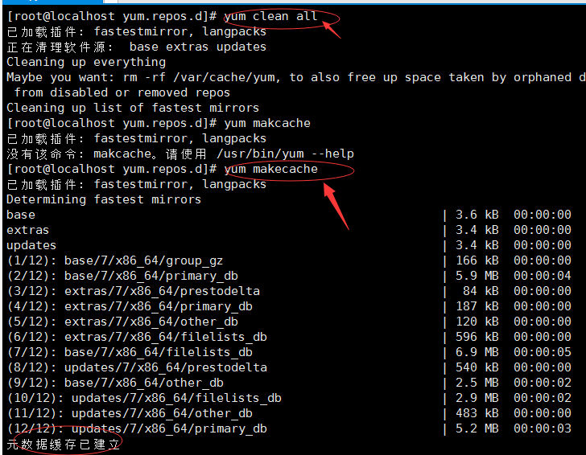
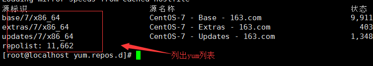

本地yum源配置：管理rpm软件包

    a、解决rpm下载问题
    b、解决rpm文件的查询
    c、解决了安装问题
    d、解决了rpm的依赖
    需要一个yum源(大量的rpm库)
    
		外网查询是否安装某个软件：yum search mysql-server
    未安装前查询软件的信息：yum info mysql-server

安装/卸载 yum install/remove ~

		Centos7下解决mysql-server没有可用包链接：https://blog.csdn.net/arvin_sc/article/details/82948802

		安装tree或者man：yum install tree/man

    [root@localhost ~]# cd /home/
    [root@localhost home]# ls
    jingan  MySQL-python-1.2.5-1.el7.x86_64.rpm  x  zhangsan
    [root@localhost home]# yum install MySQL-python-1.2.5-1.el7.x86_64.rpm 

查询

为什么默认的yum源就是在外网上，由什么决定的

		由yum的配置文件决定的
    
yum源的配置文件路径

1、备份文件(修改名字)

    下图中的备份文件因为改成了以".backup"结尾的文件所以操作系统是不读的，只读".repo"的文件

2、外网下载对应版本的repo文件，放入/etc/yum.repos.d/(操作前请做好相应备份，使用xftp的上传功能)

3、运行一下命令生成缓存

    yum clean all----清除缓存
    yum makecache----构建缓存
    

    所以经过上述步骤的操作后，下面的操作都会在163上，即已经更改了yum源
    

    list:列表
    支持glob
    all
    available: 可用的，仓库中有但尚未安装
    installed: 已经安装的
    updates: 可用的升级
    
    
    repolist: 显示repo列表及其简要信息
        all
        enabled: 默认
        disabled 
        

        
        
    install: 安装
        yum install PACKAGE_NAME
        update: 升级
        update_to: 升级为指定版本
        
    
    remove|erase: 卸载
    
    

若是无法连接外网，无法使用yum源，所以需自身构建局域网构建yum源或者本地yum源

构建本地yum源

    1、先下载大量的rpm源(或者从光盘里查找)
  
