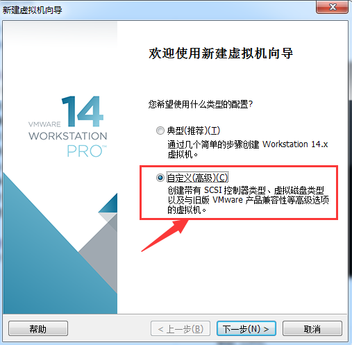
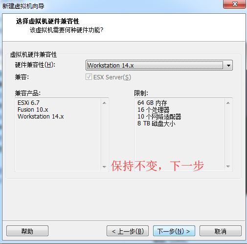
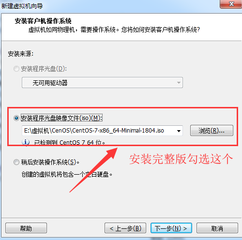
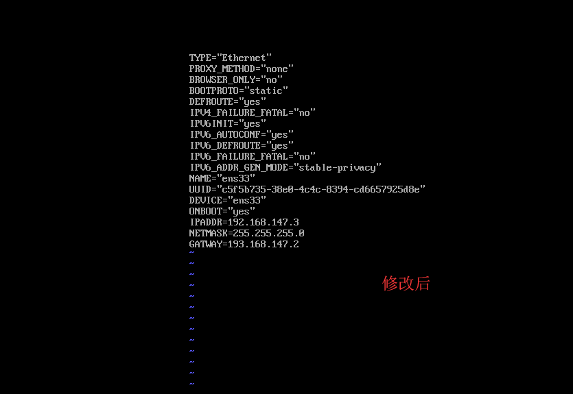

一、VMware安装简化版的linux系统

[CentOs镜像下载地址](https://opsx.alibaba.com/mirror)

    1、安装VMware workstation并创建虚拟机，操作步骤如下

    2、下载安装ISO镜像文件(www.centos.org)

    初次登录只有root登录，密码输入时在屏幕中不显示

二、VMware安装完整版的linux系统

注意此处的勾选，且下图中选择的是简化版minimal，我们需要下载一个完整版的

三、VMware安装以及CentOs镜像下载参考文档

[参考文档](https://blog.csdn.net/weixin_40067052/article/details/79346698)

四、超级管理员下设置网络

1、先输入命令：vim /etc/sysconfig/network-scripts/ifcfg-ens33

2、进入插入模式修改配置：
    设置BOOTPROPO="dhcp"（下面截图显示错误）

    设置这个系统的地址例如IPADDR=192.168.147.3

    子网掩码的地址例如NETMASK=255.255.255.0   需要跟虚拟机上子网掩码一致

    网关地址例如GATWAY=192.168.147.2  跟虚拟机上网关地址一致

    然后保存

    保存后输入ifconfig验证

    然后ping www.baidu.com  报错

    然后输入vi /etc/resolv.cof  进入设置DNS，删除注释然后输入nameserver 192.168.1.1 保存退出

    重启网络  service network restart

    再次ping www.baidu.com

    

   

