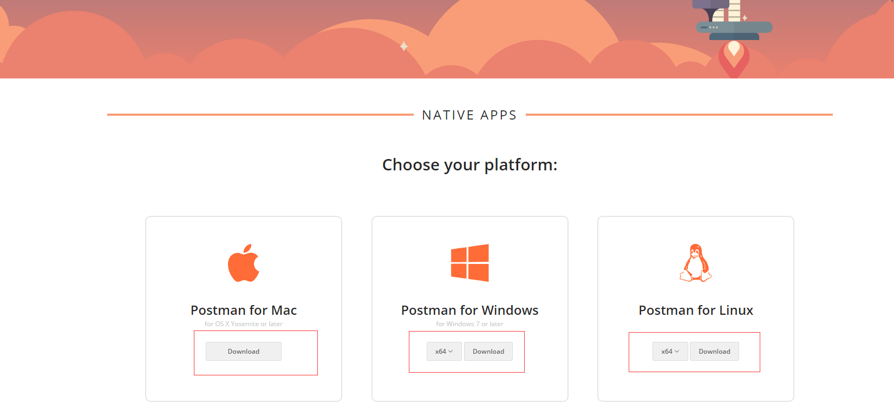
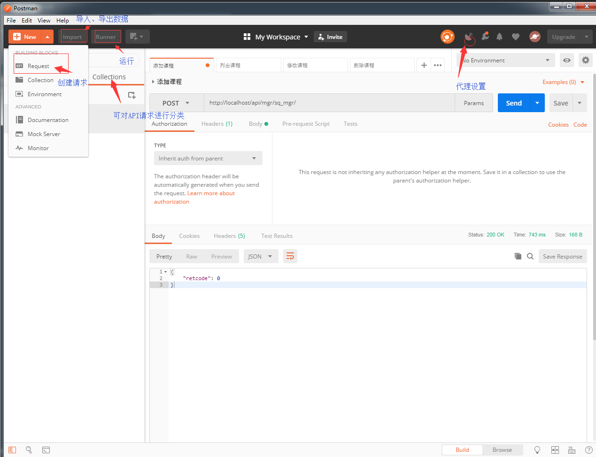
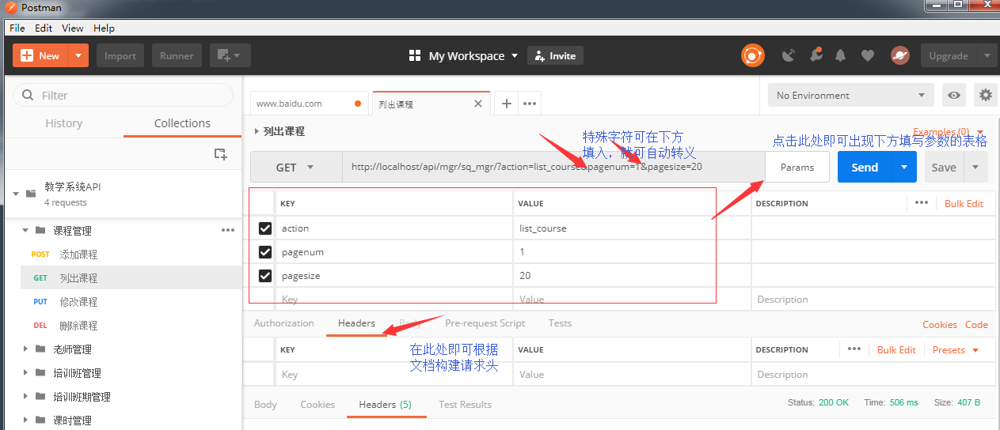
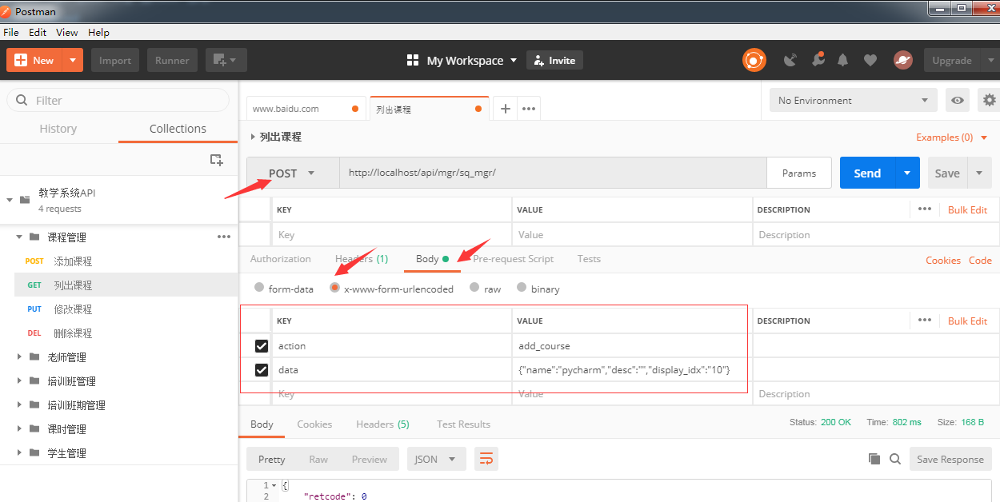
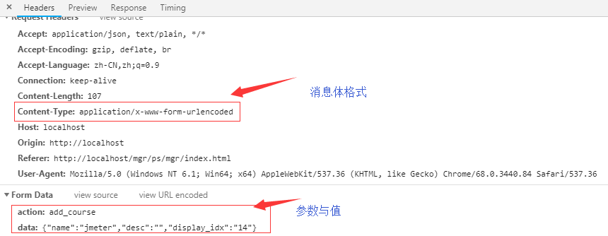
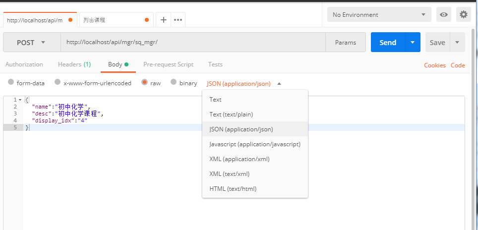
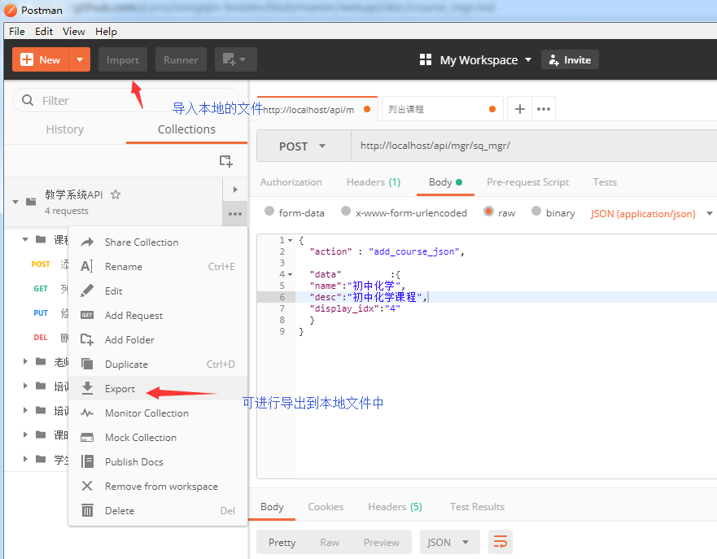

Postman使用

    不仅仅是测试工具，API开发支持
        *构建API
        *Mock Server
        *开发文档自动生成
        
安装的两种形式：

    1、本地的应用程序(https://www.getpostman.com/apps)
    2、Chrome浏览器的插件(有限制，不建议使用)
    

**构建HTTP请求**

    Postman可以快速构建HTTP请求
    参与构造的部分主要是
        *Method(请求方法)
        *URL-----(1)URL参数query string; (2)encodeURICompoent
        *Headers(请求头)
        *消息体
            1、application/x-www-form-urlencoded
            2、application/json(序列化)
            3、application/xml
            4、multipart/form-pdata
            5、其它
            
 特殊符号需要当做参数而不是分隔符的作用时，可在下图的表格中填入并且自动转义
            

使用POST方法时，因为较大，所以参数一般放在消息体中

    构建消息体：
        1、首先选择POST或其它请求方法；
        2、查看消息体格式(Content-Type)；
        3、然后在Postman工具的body中选中消息体格式
        4、最后填入键值对的参数与值
        

json描述数据结构，用字符串的方式表示，创建json格式的消息体如下

    若是别人要使用自己的接口测试用例，可使用import导出文件到本地，然后别人再用import导入即可
    若是创建了账户则会自动保存内容

    总结：接口测试流程
        *阅读API接口文档
        *编写测试用例
        *根据测试用例进行API的手工测试
        
    接口文档需要规范：比如字段长度定义，报错提示，而不是等到上层框架捕获异常报出400、500或者直接系统崩溃等错误。
    不要以存入数据库中的数据、日志内容做为测试成功的标准，因为你并不知道数据库以什么样的方式去存储才是正确的，日
    志也是不准确的，而应该以用户体验为标准，因为在页面展示的时候，还是要从数据库中获取数据的，读的过程还要进行数据格式转换渲染。通过列出接口的
    方式(即使没有UI也可用查询接口)来查看为准。