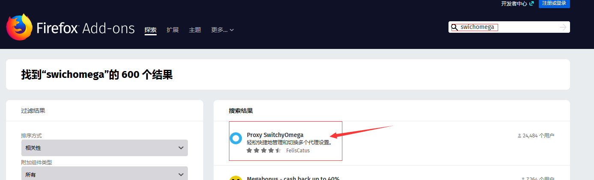

Postman API中跟测试环境相关的部分经常变动，测试的时候需要修改，比如：URL中的localhost

    解决方案：使用变量
        *Postman变量就是一个字符串标识，用来对应一个数值(通常是字符串)
        *如果Postman的API中多出使用某个字符串，我们可以使用变量代替它
        *如果另外一个测试环境中该值需要修改，我们只要修改这个变量的定义。
        
    环境里面的变量
        *支持多个环境
        *一个环境里面可以配置多个变量
        *这些变量通常是针对某个测试环境而言的，比如服务器地址、端口号
        *可以为这些不同的测试环境，设置相应的Postman环境
        *这样我们从一个环境切换到另一个环境的时候，只需要选择不同Postman环境就可以了。
        
        env1:
            var1: hello
            var2: 1234
            var3: localhost
            
        env2:
            var1: hello2
            var2：1235
            var3: 192.168.3.4
            
  示例：将localhost设置成变量的步骤
  
    1、首先在设置当中创建两个环境且VARIABLE的值要一样
    2、在所有请求行里面将localhost设置成变量(VARIABLE的值)注意需要加上双花括号"{{}}"
    3、在postman右上角可以切换环境

    设置全局变量
    *在设置中选择Globals图标
    *设置全局变量名和对应的值
    *在需要使用全局变量的地方进行添加(注意加入双花括号"{{}}")
    

Postman抓包原理： 创建代理

                ---------Http Request--------->
    Http Client                                 Http Server
                <--------Http Response---------
                
                
                ---Http Request-->Proxy---Http Request-->
    Http Client                                           Http Server
               <--Http Response--     <--Http Response-- 
               
    设置代理的步骤：
        1、点击图片弹出代理设置窗口(PROXY SETTINGS)
        2、代理窗口中输入端口号，设置抓的包存放位置以及过滤条件
        3、Filters页面点击Save保存，在connection中点击connect,弹窗选择允许访问
        4、选择某浏览器(火狐浏览器)设置代理
        5、在火狐浏览器安装swithomega插件
        6、安装插件成功后进入proxy并新建情景模式
        7、在情景模式中设置代理协议、代理服务器、端口号(注意：需要把下方的localhost以及127.0.0.1删除)并保存
        8、在浏览器右上角图标的下拉框中选择postman
        9、 现在进行操作后postman就会进行抓包然后放到你所设置存放的地方(History)
        
        手机抓包原理类似  

  

   

 

 

  

             