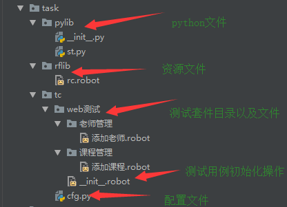

1、项目目录和执行参数
    
    自动化项目的目录一般目录结构
    一般可接触到的项目文件种类
        >测试套件文件、目录
        >RF资源文件
        >测试库
        >变量文件   
        
    1、建议的目录结构

    2、以 robot --pythonpath . tc 命令执行tc用例下面所有的用例
    3、builtin库里面的Run Keywords方法实现初始化
    
2、RF用例的执行

    1、指定生成测试报告的命令    
    d:\tmp\rf\task>robot --pythonpath . --name 回归测试  tc
    
    2、可以指定多个要执行的测试套件文件、目录甚至用通配符来表示多个测试，用空格隔开
    d:\tmp\rf\task>robot my_test.robot your-tests.robot
    
    3、根据名称选择测试用例
    可以通过 --test --suite来指定执行哪些用例或者套件，且可以支持用通配符的方式(注意测试源一定要放在最后，如下方的tc)
        
        --test 添加老师                 #执行名为添加老师的用例
        d:\tmp\rf\task>robot --pythonpath . --name 回归测试 --test 添加老师 tc
        
        --test mytest --test yourtest   #执行名为mytest和yourtest的用例
        --test example*                 #执行名字以example开头的用例
        
        --suite 课程管理                 #执行名为课程管理的套件
        d:\tmp\rf\task>robot --pythonpath . --name 回归测试 --suite 课程管理 tc
        
    4、在写用例的时候可写入编号，方便导出测试例如有如下用例：
        用例管理1 - tc00001
            log to console tc000001
        用例管理2 - tc00002
            log to console tc000002
        用例管理3 - tc00003
            log to console tc000003
        用例管理4 - tc00004
            log to console tc000004
        用例管理5 - tc00005
            log to console tc000005
            
        导出用例编号执行(*表示无论用例前面是什么只要对应后面编号即可，t1.robot为放这些用例的文件名即测试源)
        robot --pythonpath .  --test*tc00001 --test*tc00002 --test*tc00003 --test*tc00004 --test*tc00005 t1.robot
        
        如果用例太多也不适合上述方法，所以可以放到参数文件当中，比如创建一个args.txt,内容如下：
            --pythonpath .
            --name 回归测试
            --test *tc00001
            --test *tc00004
            --test *tc00005
            t1.robot
            
        再用命令执行：   robot -A args.txt
        
    关键字之间有依赖关系的，最好做在类当中(即公用的部分比如登录操作)，如果只是定义在函数中，则只能作为局部变量

    
    
        