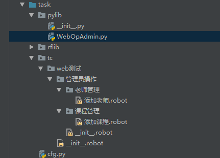
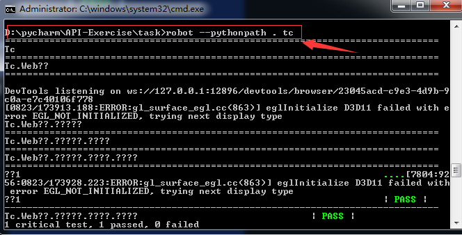

    用例1：添加课程功能
    
    前置条件：系统中没有课程，
    
    步骤 1： 添加课程，输入课程名、详情描述、展示次序为2，点击创建
    预期结果：创建的课程正确显示在下面的表中。
    
    step 2： 再添加一门课程，输入课程名、详情描述、展示次序为1，点击创建
    预期结果：创建的课程正确显示在下面的表中，并且按照展示次序排列。
    
     
    用例2：添加老师功能
    
    前置条件：系统中没有老师，已经有课程 ‘初中语文’，‘初中数学’
    
    step 1： 添加老师，输入老师姓名、登录名、描述、展示次序为2，选择课程 ‘初中语文’
    预期结果：创建的老师正确显示在下面的表中。
    
    step 2： 再添加一个老师，展示次序为1，选择课程 ‘初中数学’
    预期结果：创建的老师正确显示在下面的表中，并且按照展示次序排列。
    
    
    用例3：添加培训班
    前置条件：系统中还没有培训班，已经有课程 ‘初中语文’，‘初中数学’
    step 1： 添加培训班，输入培训班名（初中班）、详情描述、展示次序为1，包含课程为初中语文’和‘初中数学’，点击创建
    预期结果：创建的培训班正确显示在下面的表中。
    
    
    用例4：添加培训班期
    前置条件：系统中还没有培训班期，已经有课程 ‘初中语文’，‘初中数学’，并且有培训班 初中班
    step 1： 添加培训班期，输入培训班期名（初中班1期）、详情描述、展示次序为1，所属培训班为（初中班）， 点击创建
    预期结果：创建的培训班期正确显示在下面的表中。
    
  
    将所有的关键字的实现 改为Python 代码中实现
    
用例的目录结构如下图：



WebOpAdmin.py
```python
from selenium import webdriver
from cfg import *
import time
from selenium.webdriver.support.ui import Select

# 类名和模块名最好一致,便于指定用例运行
class WebOpAdmin:
    # 保证仅实例化一次
    ROBOT_LIBRARY_SCOPE = 'GLOBAL'

    def setupWebTest(self,driverType='chrome'):
        # self.cur_wd保存WebDriver对象
        self.cur_wd = None
        if driverType == 'chrome':
            self.cur_wd = webdriver.Chrome()
        elif driverType == 'firefox':
            self.cur_wd = webdriver.Firefox()
        else:
            raise Exception('unknow driver type %s' %driverType)

        self.cur_wd.implicitly_wait(10)
        self.cur_wd.maximize_window()

    def tearDownWebTest(self):
        self.cur_wd.quit()


    def LoginWebSite(self):
        self.cur_wd.get(MgrLoginUrl)

        self.cur_wd.find_element_by_id('username').send_keys(adminuser['name'])
        self.cur_wd.find_element_by_id('password').send_keys(adminuser['pw'])
        self.cur_wd.find_element_by_tag_name('button').click()


    def AddCourse(self, name, desc, idx):
        self.cur_wd.find_element_by_css_selector("ul.nav a[ui-sref='course']").click()
        time.sleep(1)

        #ng-click^='showAddOne'中'^='表示以什么开头
        self.cur_wd.find_element_by_css_selector("button[ng-click^='showAddOne']").click()

        # 先清空输入框内容再填入课程名称
        ele = self.cur_wd.find_element_by_css_selector("input[ng-model='addData.name']")
        ele.clear()
        ele.send_keys(name)

        #先清空输入框内容再填入详情内容
        ele = self.cur_wd.find_element_by_css_selector("textarea[ng-model='addData.desc']")
        ele.clear()
        ele.send_keys(desc)

        # 先清空输入框内容再填入序号
        ele = self.cur_wd.find_element_by_css_selector("input[ng-model='addData.display_idx']")
        ele.clear()
        ele.send_keys(idx)

        #点击创建按钮
        self.cur_wd.find_element_by_css_selector("button[ng-click^='addOne']").click()
        time.sleep(1)


    def AddTeacher(self, relname, username, desc, idx, lesson):
        # 点击老师按钮
        self.cur_wd.find_element_by_css_selector("ul.nav a[ui-sref='teacher']").click()

        # 点击添加老师按钮
        self.cur_wd.find_element_by_css_selector('button[ng-click^=showAddOne]').click()

        # 清空内容并输入老师姓名
        ele = self.cur_wd.find_element_by_css_selector("input[ng-model='addEditData.realname']")
        ele.clear()
        ele.send_keys(relname)

        # 输入登录名
        ele = self.cur_wd.find_element_by_css_selector("input[ng-model='addEditData.username']")
        ele.clear()
        ele.send_keys(username)

        # 输入描述信息
        ele = self.cur_wd.find_element_by_css_selector("textarea[ng-model='addEditData.desc']")
        ele.clear()
        ele.send_keys(desc)

        #输入序号
        ele = self.cur_wd.find_element_by_css_selector("input[ng-model='addEditData.display_idx']")
        ele.clear()
        ele.send_keys(idx)

        # 选择授课信息('*='符号表示以什么结尾)
        select = Select(self.cur_wd.find_element_by_css_selector('select[ng-model*=courseSelected]'))
        select.select_by_visible_text(lesson)
        self.cur_wd.find_element_by_css_selector('button[ng-click*=addTeachCourse]').click()

        # 点击创建按钮
        self.cur_wd.find_element_by_css_selector("button[ng-click^='addOne']").click()
        time.sleep(1)


    def DeleteAllCourse(self):

        self.cur_wd.find_element_by_css_selector('ul.nav a[ui-sref=course]').click()
        time.sleep(1)

        self.cur_wd.implicitly_wait(2)
        while True:
            delButtons = self.cur_wd.find_elements_by_css_selector('*[ng-click^=delOne]')

            if delButtons == []:
                break

            delButtons[0].click()
            self.cur_wd.find_element_by_css_selector('.modal-footer  .btn-primary').click()
            time.sleep(1)

        self.cur_wd.implicitly_wait(10)


    def DeleteAllTeacher(self):

        self.cur_wd.find_element_by_css_selector('ul.nav a[ui-sref=teacher]').click()
        time.sleep(1)

        self.cur_wd.implicitly_wait(2)
        while True:
            delButtons = self.cur_wd.find_elements_by_css_selector('*[ng-click^=delOne]')

            if delButtons == []:
                break

            delButtons[0].click()
            self.cur_wd.find_element_by_css_selector('.modal-footer  .btn-primary').click()
            time.sleep(1)

        self.cur_wd.implicitly_wait(10)


# delete_xxx 基本差不多，可以考虑抽象为一个通用的,后面delete班，班期 就不用开发关键字函数了
    def DeleteAll(self,objName):
        # 如果是删除课程就先点击课程图标按钮
        if objName=='course':
            self.cur_wd.find_element_by_css_selector('ul.nav a[ui-sref=course]').click()
        # 如果是删除老师就先点击老师图标按钮
        elif objName=='teacher':
            self.cur_wd.find_element_by_css_selector('ul.nav a[ui-sref=teacher]').click()
        else :
            raise Exception('keyword DeleteAll get unknow obj Name %s' % objName)

        time.sleep(1)

        self.cur_wd.implicitly_wait(2)
        while True:
            delButtons = self.cur_wd.find_elements_by_css_selector('*[ng-click^=delOne]')

            if delButtons == []:
                break

            delButtons[0].click()
            self.cur_wd.find_element_by_css_selector('.modal-footer  .btn-primary').click()
            time.sleep(1)

        self.cur_wd.implicitly_wait(10)


    def GetCourseList(self):
        self.cur_wd.find_element_by_css_selector('ul.nav a[ui-sref=course]').click()
        time.sleep(1)

        # 试试 //tr/td[2]/span/text()
        eles = self.cur_wd.find_elements_by_css_selector('tr>td:nth-child(2)')

        return  [ele.text for ele in eles]


    def  GetTeacherList(self):

        time.sleep(1)

        self.cur_wd.find_element_by_css_selector('ul.nav a[ui-sref=teacher]').click()
        eles = self.cur_wd.find_elements_by_css_selector('tr>td:nth-child(2)')

        return  [ele.text for ele in eles]

```

添加老师.robot
```robotframework
*** Settings ***
Library    SeleniumLibrary
Library    pylib.WebOpAdmin


*** Test Cases ***
测试1
    [Setup]  DeleteAllCourse

    AddCourse    初中数学    初中数学   1

    ${lessons}=  Get Course List


    Should Be True   $lessons==['初中数学']


    [Teardown]     DeleteAllCourse
```

添加课程.robot
```robotframework
*** Settings ***
Library    pylib.WebOpAdmin


*** Test Cases ***
添加老师1
    [Setup]  run keywords   DeleteAllTeacher
    ...   AND  DeleteAllCourse
    ...   AND  AddCourse   初中语文   初中语文   1
    ...   AND  AddCourse   初中数学   初中数学   2


    AddTeacher     庄子    zhuangzi    庄子老师   2    初中语文

    AddTeacher     孔子     kongzi     孔子老师   1    初中数学
    ${teachers}=    Get Teacher List

    Should Be True    ['孔子','庄子']==$teachers

    [Teardown]  run keywords   DeleteAllTeacher   AND   DeleteAllCourse

```

第一个__init__.robot
```robotframework
*** Settings ***
Library         pylib.WebOpAdmin
Suite Setup     LoginWebSite
```

第二个__init__.robot
```robotframework
*** Settings ***
Library         pylib.WebOpAdmin

Suite Setup     SetupWebTest
Suite Teardown  TeardownWebTest
```

cfg.py
```python
MgrLoginUrl = 'http://localhost/mgr/login/login.html'
adminuser = {'name':'auto' , 'pw':'sdfsdfsdf'}
```

