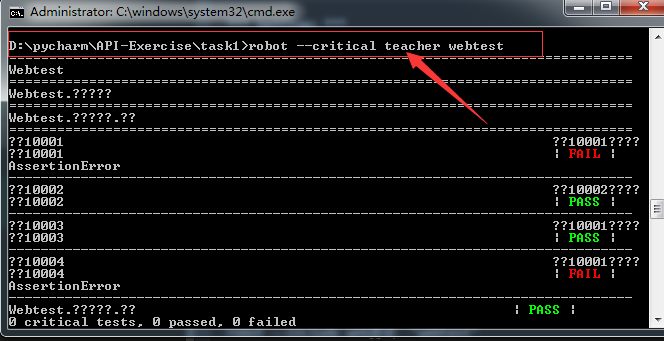

1、RF用例标签

    测试用例可以有多个标签，根据任何一个标签都可以过滤到该用例
    
2、RF打标签的方式

    (1)Setting表里的Force Tags
        *该套件里面所有测试用例都具有该tag
       
    (2)测试用例表里的[tags]配置
    
    (3)Setting表里的Default Tags
        *该套件里面所有没有[tags]设置的测试用例都具有该tag
        *测试目录里面的__init__.robot不支持Default Tags
        
3、根据标签选择测试用例

    (1)执行包含标签'foo'的用例
        --include foo
        
    (2)执行不包含标签'foo'的用例
        --exclude foo
        
    (3)执行同时包含标签'one' , 'web test'用例(有空格需要添加双引号)
        --include oneAND"web test"
        
    (4)执行包含标签'one'或者'two'的用例
        --include oneORtwo
        --include one --include two
        
    (5)执行包含标签'one'但不包含标签'two'
        --include oneNOTtwo
        
    (6)执行标签格式为W*W的用例
        --include w*w
        
示例如下：


其目录中所对应的文件内容如下：

    webtest下的__init__.robot文件
```robotframework
*** Settings ***
Force Tags     web测试
```

    管理员功能下的__init__.robot文件
```robotframework
*** Settings ***
Force Tags     admin
```

    管理员功能下的登录.robot文件
```robotframework
*** Settings ***
Force Tags       登录   冒烟测试
#没有设置标签，就使用以下默认标签
Default Tags     notag


*** Test Cases ***
用例10001
    [Tags]    正确用户名    正确密码     10001
    log to console        用例10001主体部分
    Fail

用例10002
    [Tags]    正确用户名    正确密码     10002
    log to console        用例10002主体部分

用例10003
    [Tags]    正确用户名    错误密码     10003
    log to console        用例10001主体部分

用例10004
    [Tags]
    log to console        用例10001主体部分
    Fail
```

    老师功能下__init__.robot文件
```robotframework
*** Settings ***
Force Tags     teacher
```

    老师功能下登录.robot文件
```robotframework
*** Settings ***
Force Tags       登录   冒烟测试


*** Test Cases ***
用例30001
    [Tags]    正确用户名    正确密码
    log to console        用例30001主体部分

用例30002
    [Tags]    正确用户名    正确密码
    log to console        用例30002主体部分
```
    "webtest"表示源文件
    robot --include web测试  "webtest"
    
    只要有冒烟测试标签都会执行
    robot --include 冒烟测试 "webtest"
    
    robot --include * "webtest"
    
4、指定关键测试用例

    (1)如果本次测试中有关键测试用例没有通过，那么整个测试就被视为测试不通过。反之整个测试就视为通过
    
    (2)缺省情况下，RF执行测试时，每个测试用例都被视为关键测试用例
    
    (3)我们可以通过命令参数 --critical(-c)和 --noncritical(-n)后面加tag名来指定测试用例是否为关键测试用例
        *--critical regresion 指定只有具有regresion标签的用例才时关键用例
        *--noncritical not_ready 指定不具有not_ready标签的用例才是关键用例，其它都不是关键用例
        *--critical ok* --noncritical tbd* 指定具有以ok开头的标签且没有以tbd为开头的标签的用例都是关键用例
        
    (4)通常我们可以在关键用例中打上标签，比如basic表示是关键用例
    



    log日志与report报告相比日志的信息相对详细
    
5、指定console输出格式
    
    *可以通过--dotted --quiet来指定这次执行的console输出格式
    *让执行过程更加的精简清晰
        >robot --quiet tests.robot #除了出错和警告信息，不输出其它信息
        >robot --dotted tests.robot #执行用例用"."表示通过的用例，F表示错误的用例
        
总结RF框架作用：

    *为测试用例的开发提供清晰明了的关键字定义用例的模式
    *为自动化项目的套件、用例目录结构提供初始化清除机制
    *为自动化项目的执行提供灵活的用例、套件选择机制
    *为测试结果提供清晰、细致的日志和报表
       