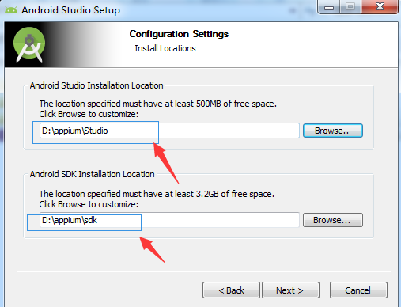

（1）开源、跨平台、多语言支持的，移动应用自动化工具

（2）测试对象

　　原生app；

　　混合（Hybrid）app；

　　移动web app

（3）测试对象App运行平台：

　　ios、Android、Windows、FirefoxOS

（4）测试对象App运行环境：

　　真实设备；

　　模拟器

框架：

	苹果：UIAutomation / XCTest

	安卓：UIAutomator

安装步骤：

（1）安装Appium Python Client包

　　pip install Appium-Python-Client

 
	确保安装匹配版本的selenium和appium

　pip install selenium -U （可升级到最新版本）

（2）安装Appium Server

	方法一：node.js    &   npm
		npm install -g appiium

 
	方法二：Appium Desktop

		项目地址： https://github.com/appium/appium-desktop

		下载地址： https://github.com/appium/appium-desktop/releases/latest
		

（3）安装Android Studio

	安卓app的自动化、Appium Server依赖于 Android SDK
	官方网站：
		https://developer.android.com/studio/index.html
		https://developer.android.google.cn/studio/archive.html

　官方中文网站：
		https://developer.android.google.cn

	最好在以下网站下载Android Studio，因为同时包含了Android SDK
		https://developer.android.google.cn/studio/archive
		

	下载后双击安装即可，安装路径尽可能简便

	出现下面的界面直接点击cancel删除即可

	首次运行Android studio,需要创建一个项目，因为会用到Android studio里的工具（用虚拟机管理器创建虚拟机）
	

	（4）安装JDK
		http://www.oracle.com/technetwork/java/javase/downloads/jdk8-downloads-2133151.html（下载JDK网址）
		设置环境变量：其变量名为“JAVA_HOME”，变量值为JDK的安装路径；
		

	（5）安装安卓手机模拟器
		需要CPU支持虚拟化（BIOS中要开启）
		

选择机型，操作系统版本
主要设置内存，不可设置太多也不可太小，一般设置为1.5-2G

如果报下面的错误就安装z在sdk中找到HAXM进行手动安装

